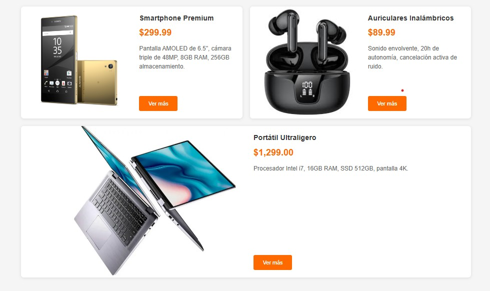

# Catálogo de Productos - Web App

## Descripción
Aplicación web responsive que muestra un catálogo de productos con diseño moderno inspirado en Mercado Libre. Cada producto se presenta en tarjetas divididas visualmente en dos secciones: mitad imagen y mitad detalles técnicos, con animaciones suaves y colores vibrantes.

## Características
- **Diseño responsive** adaptable a diferentes tamaños de pantalla
- **Interfaz moderna** con efectos hover en las tarjetas de productos
- **Layout dividido** 50% imagen / 50% información
- **Carga dinámica** de productos mediante JavaScript
- **Paleta de colores** profesional (naranjas vibrantes sobre fondos claros)
- **Tipografía limpia** con fuentes sans-serif
- **Botón interactivo** para acciones de compra
